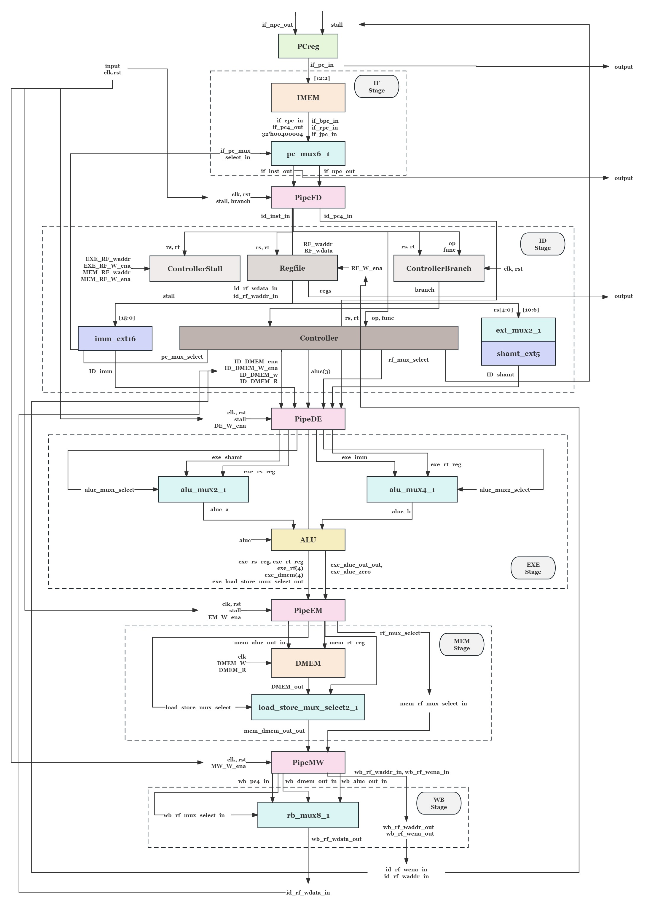
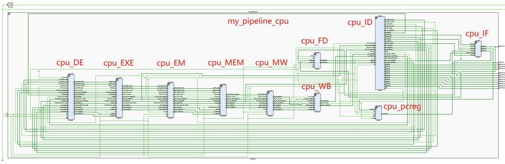

# Pipelined CPU Design and Performance Analysis

## Overview

The project involved designing and analyzing a static pipelined CPU, outlining its overall structure and operation. The design was divided into five stages: Instruction Fetch (IF), Instruction Decode (ID), Execution (EXE), Memory Access (MEM), and Write Back (WB). Each stage had specific responsibilities, such as fetching and decoding instructions, executing calculations, and accessing memory. Additionally, pipeline registers were included to facilitate the transfer of intermediate variables between stages. The implementation was carried out in a specified environment using appropriate hardware and software tools.

## Environment Deployment and Hardware Configuration

- **Operating System:** Windows 10
- **Software Environment:** Vivado v2016.2, MARS 4.5
- **Compiler:** Visual Studio Code
- **Hardware Device:** Nexys 4 DDR Artix-7 FPGA Trainer Board

## Overall Structure of the Experiment

As shown in the figure above, the design of the **static pipelined CPU** is divided into the following five stages:

- **Instruction Fetch (IF) Stage:** Responsible for retrieving instructions from memory to prepare for decoding. This includes the program counter (PC), instruction memory (IMEM), and several multiplexers that work together to fetch instructions and calculate addresses.

- **Instruction Decode (ID) Stage:** Responsible for decoding the fetched instructions, involving the Regfile (for reading operand values), the controller (for generating control signals), and the value extension module.

- **Execution (EXE) Stage:** Executes the specific calculations or processing of instructions, involving the arithmetic logic unit (ALU) and two multiplexers used for ALU control.

- **Memory Access (MEM) Stage:** Responsible for reading or writing data from/to the data memory, which includes read and write operations on the data memory (DMEM).

- **Write Back (WB) Stage:** Writes the results of computations or memory accesses back to the register file.

Additionally, the structure includes several pipeline registers (such as PipeFD, PipeDE, etc.) located between each stage to store and pass intermediate variables.

The above figure shows the RTL analysis diagram of the static pipelined CPU I designed.